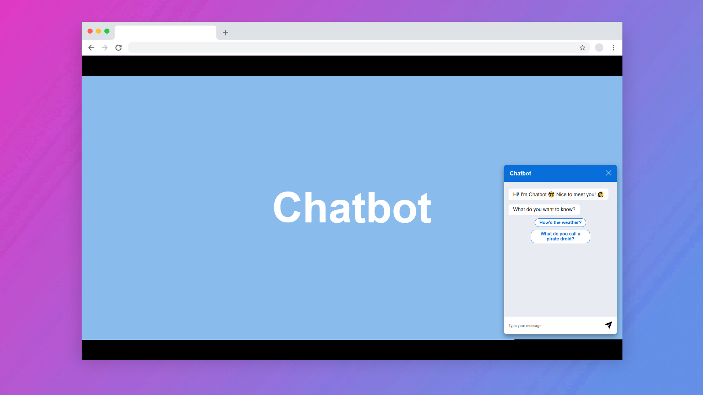
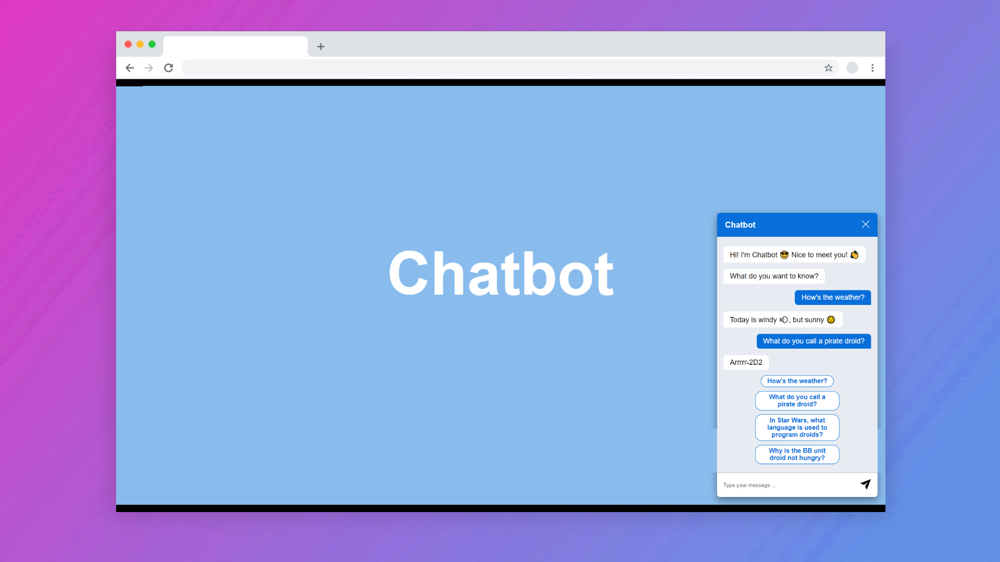

# 🤖 Chatbot

## Table of contents
* ℹ️ [General info](#general-info)
* 🎉[Project overview](#project-overview)
* 📖 [What I learned during this project?](#what-i-learned-during-this-project)
* ⚙️ [Technologies](#technologies)
* 📷 [Screenshots](#screenshots)
* 💾 [Installation](#installation)
* 📜 [Available scripts](#available-scripts)
* 🔴 [Live](#live)

## ℹ️ General info

Chatbot Application

## 🎉 Project Overview

This is a basic chatbot application. The user can talk to the bot by typing or selecting predefined options. The bot searches for keywords, if it finds them, it responds with a predefined answer. The chatbot closes when the close button is clicked, or clicked outside the chatbot. The project is initialized entirely in a script. 

## 📖 What I learned during this project?

The biggest problem with this project was the object-oriented programming approach. I had to separate the program into classes. I used the SOC (Separation of concerns) design pattern.
	
## ⚙️ Technologies used in project:

| Tech                                                    | Description                              |
| ------------------------------------------------------- | ---------------------------------------- |
| [Parcel](https://parceljs.org/)                         | Build tool for the web.                  |
| [Typescript](https://www.typescriptlang.org/)           | Javascript superset language             |
| [Sass](https://sass-lang.com/)                          | Css extension                            |
| [Eslint](https://eslint.org/)                           | Javascript Linter                        |
| [Prettier](https://prettier.io/)                        | Code formatter                           |

## 📷 Screenshots

<p align="center">
    
</p>

<p align="center">
    
</p>

## 💾 Installation

To run this project, install it locally using npm:

```
git clone https://github.com/Danilus120/Chatbot.git

npm install

npm run dev
```

## 📜 Available scripts

| Command                   | Description                   |
| ------------------------- | ----------------------------- |
| `npm run dev`             | Open local server             |
| `npm run build`           | Create optimized build        |


## 🔴 Live

https://chatbot-danilus120.netlify.app/